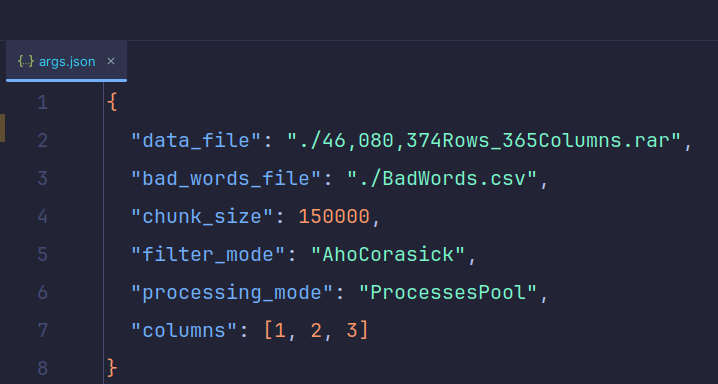

<h1 align="center">Bad Words Detector</h1>

<div align="center">


</div>

A project given to FCI 2021-2025 Suez University Class to test their capabilities in the subject.

Subject: CS342 Automata and Language Theory

## Usage

Detect bad words from a .csv file compressed in a .rar format using the provided Bad_Words.csv file and output both excel and .csv files that have analytics about the process.

## Documentation

[Documentation](.assets/Docs/Docs.md)

## Required Packages

```
Python 3.10 or newer

pandas

pyahocorasick

rarfile

openpyxl

pytest
```

## How To Use

### First method

#### 1- Clone the repo ( using HTTPS or SSH ) and run it through any IDE you like

#### 2- Navigate to the args.json file and put your .csv file in .rar compression format and pass the path into the data_file section

#### 3- Navigate then to the main.py file and run the file

### Screenshots




### Second method

#### 1- Clone the repo ( using HTTPS or SSH ) and navigate to the project's folder with your terminal

```sh
git clone https://github.com/GreenVenom77/Bad_Words_Detector.git

cd Bad_Words_Detector
```

#### 2- Run the help command to see the arguments

```sh
python main.py -h
```

#### 3- Run the program using the command below

```sh
python main.py -d './46,080,374Rows_365Columns.rar' -b './BadWords.csv' -s 150000 -f 'AhoCorasick' -p 'ProcessesPool' -c '1,2,3'
```

### Help menu

```sh
usage: Bad Words Filter App [-h] -d DATA_FILE -b BAD_WORDS_FILE [-s CHUNK_SIZE] [-f {Regex,AhoCorasick}]
                            [-p {MultiThreading,MultiProcessing,ProcessesPool}] [-c COLUMNS]

filter the specified columns from a big compressed csv file the bad words rows.

options:
  -h, --help            show this help message and exit
  -d DATA_FILE, --data_file DATA_FILE
                        The csv file that we will filter
  -b BAD_WORDS_FILE, --bad_words_file BAD_WORDS_FILE
                        The name of bad words file
  -s CHUNK_SIZE, --chunk_size CHUNK_SIZE
                        The chunk size will be processed
  -f {Regex,AhoCorasick}, --filter_mode {Regex,AhoCorasick}
                        The mode of filtering.
  -p {MultiThreading,MultiProcessing,ProcessesPool}, --processing_mode {MultiThreading,MultiProcessing,ProcessesPool}        
                        the concurrent model that will work
  -c COLUMNS, --columns COLUMNS
                        specified columns that will be filtered in format column1,column... like 1,2,3,4
```

# Community

Any contribution is very welcomed even if it's a small one.
